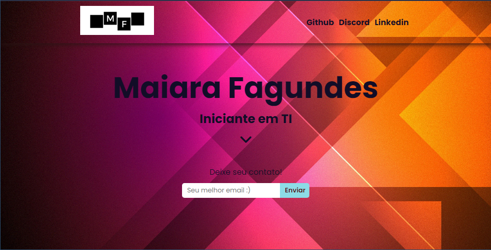

<h1>Primeiro Portólio pessoal </h1>

Primeiro portfólio feito em HTML e CSS

# Objetivo

 Apresentar meu porfólio feito realizado em HTML e CSS

# Tecnologias

Foi usado na construção do projeto:

- [HTML](https://www.w3schools.com/html/)
- [CSS](https://www.w3schools.com/css/)

# Pre-requisitos

Ter instalado em sua máquina as seguintes ferramentas:

•  Editor de Trabalho: VSCode

# Resultado

<h1 align="center">
  
</h1>
